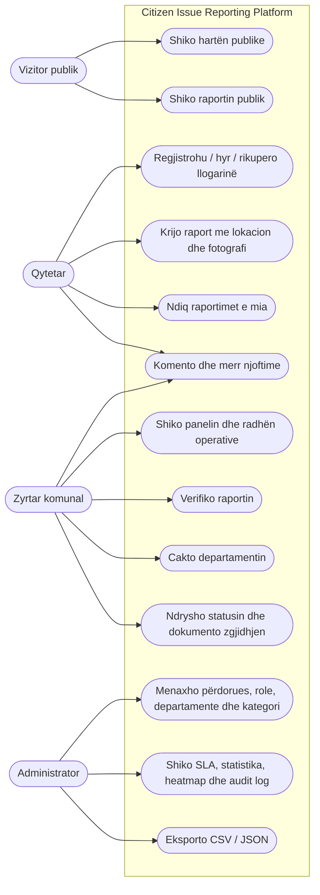
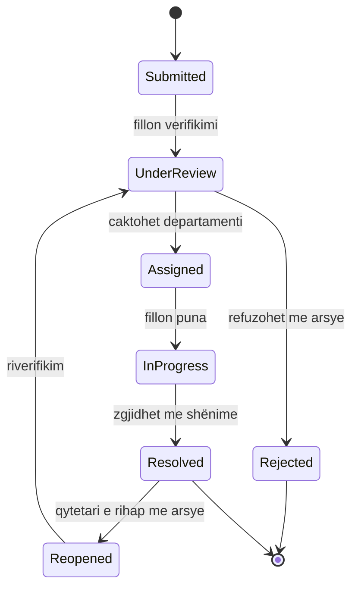
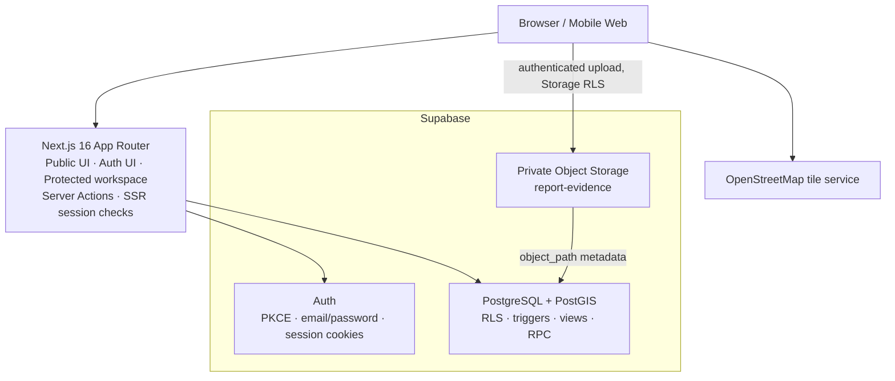
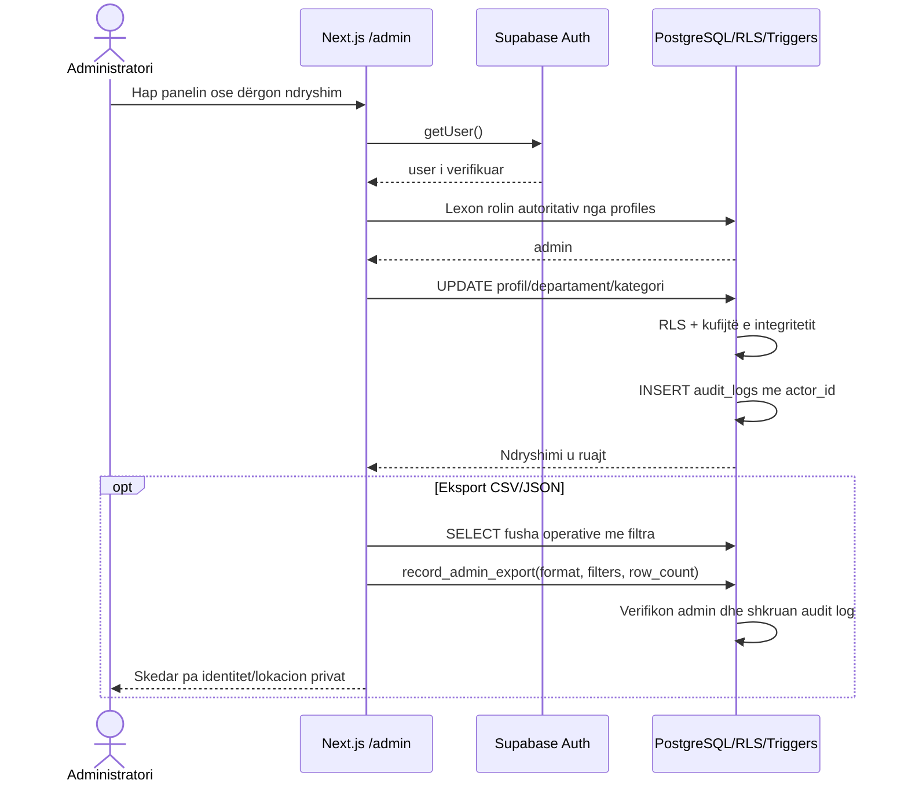
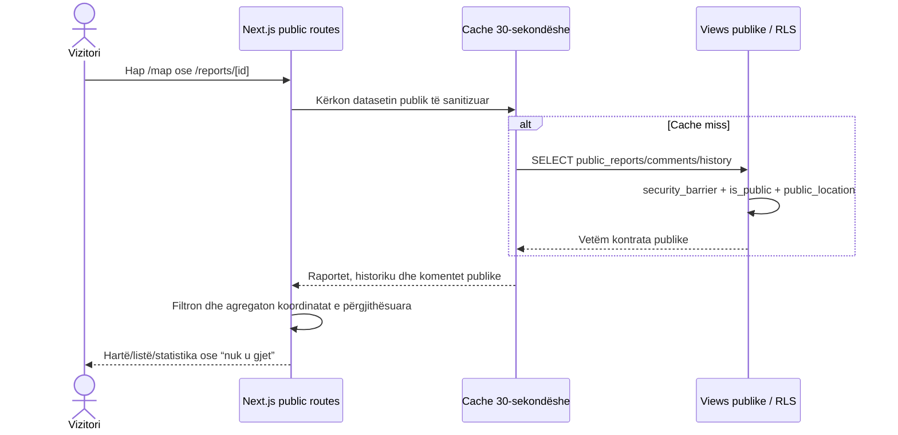
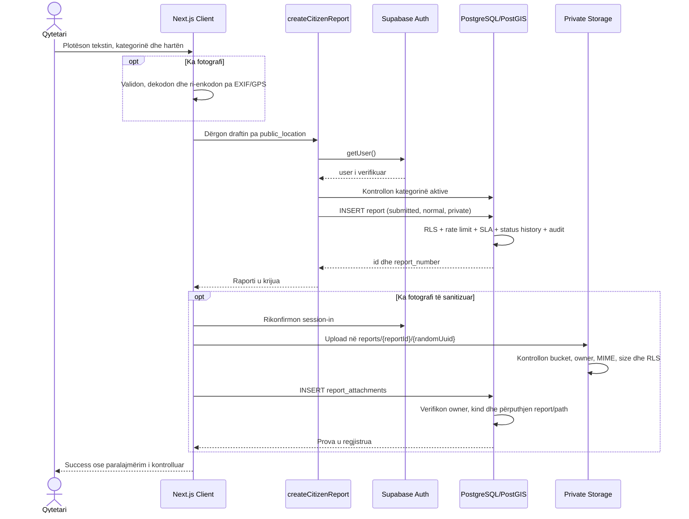
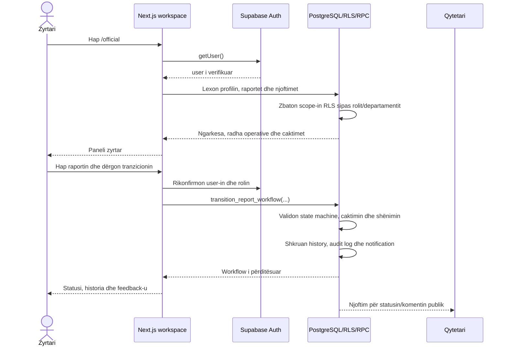

# Diagramet autoritative

Diagramet Mermaid më poshtë pasqyrojnë migrations dhe kodin real pas Sprintit
8, duke përfshirë panelet qytetar/zyrtar/admin dhe transparencën publike.
Skedarët e vjetër PNG/Draw.io
në këtë dosje ruhen si drafte historike të
paketës fillestare; ata nuk përdoren si burim i së vërtetës kur devijojnë nga
ky dokument.

Para dorëzimit final në Sprintin 10, këto diagrame eksportohen në figurat me
numërim dhe stilin e punimit të FIMK-ut.

## Use-case diagram



Të gjitha rastet e përdorimit të paraqitura më sipër janë implementuar deri në
Sprintin 8. Vizualizimi publik/administrativ i dendësisë përdor vetëm
koordinata publike të përgjithësuara.

## State diagram i raportit



Këto janë saktësisht kalimet që zbaton
`validate_report_status_transition()`.

## ER diagram

```mermaid
erDiagram
  AUTH_USERS ||--|| PROFILES : "zgjeron"
  AUTH_USERS ||--o{ REPORTS : "raporton"
  AUTH_USERS ||--o{ REPORT_COMMENTS : "shkruan"
  AUTH_USERS ||--o{ REPORT_ATTACHMENTS : "ngarkon"
  AUTH_USERS ||--o{ NOTIFICATIONS : "pranon"
  DEPARTMENTS ||--o{ PROFILES : "ka zyrtarë"
  DEPARTMENTS ||--o{ CATEGORIES : "përgjegjës për"
  DEPARTMENTS ||--o{ REPORTS : "trajton"
  CATEGORIES ||--o{ REPORTS : "klasifikon"
  REPORTS ||--o{ REPORT_STATUS_HISTORY : "ka histori"
  REPORTS ||--o{ REPORT_COMMENTS : "ka komente"
  REPORTS ||--o{ REPORT_ATTACHMENTS : "ka prova"
  REPORTS ||--o{ NOTIFICATIONS : "gjeneron"
  AUTH_USERS ||--o{ AUDIT_LOGS : "vepron"

  AUTH_USERS {
    uuid id PK
    text email
  }
  PROFILES {
    uuid id PK_FK
    text email
    text full_name
    user_role role
    uuid department_id FK
  }
  DEPARTMENTS {
    uuid id PK
    text code
    text name
    boolean is_active
  }
  CATEGORIES {
    uuid id PK
    text slug
    text name
    smallint default_sla_hours
    uuid department_id FK
  }
  REPORTS {
    uuid id PK
    bigint report_number UK
    uuid citizen_id FK
    uuid category_id FK
    uuid department_id FK
    report_status status
    report_priority priority
    geography location_private
    geography public_location
    timestamptz sla_due_at
    boolean is_public
  }
  REPORT_STATUS_HISTORY {
    uuid id PK
    uuid report_id FK
    report_status previous_status
    report_status new_status
    uuid changed_by FK
    timestamptz created_at
  }
  REPORT_COMMENTS {
    uuid id PK
    uuid report_id FK
    uuid author_id FK
    text body
    boolean is_internal
    timestamptz created_at
  }
  REPORT_ATTACHMENTS {
    uuid id PK
    uuid report_id FK
    uuid uploaded_by FK
    text object_path UK
    attachment_kind kind
    boolean is_internal
  }
  NOTIFICATIONS {
    uuid id PK
    uuid recipient_id FK
    uuid report_id FK
    text type
    timestamptz read_at
  }
  AUDIT_LOGS {
    uuid id PK
    uuid actor_id FK
    text action
    text entity_type
    uuid entity_id
    jsonb details
    timestamptz created_at
  }
```

`audit_logs` është tabelë append-only me `actor_id`, `action`, `entity_type`,
`entity_id`, `details` dhe `created_at`; lidhja me entitetin është logjike
sepse auditimi mund të përfshijë disa lloje entitetesh.

## Architecture diagram



Nuk ekziston backend i veçantë Express/NestJS në implementimin aktual.
Autorizimi për të dhënat mbetet në PostgreSQL RLS dhe Storage policies.

## Sequence diagram — administrimi dhe eksporti



## Sequence diagram — transparenca publike



## Sequence diagram — krijimi i raportit



## Sequence diagram — paneli dhe workflow zyrtar


