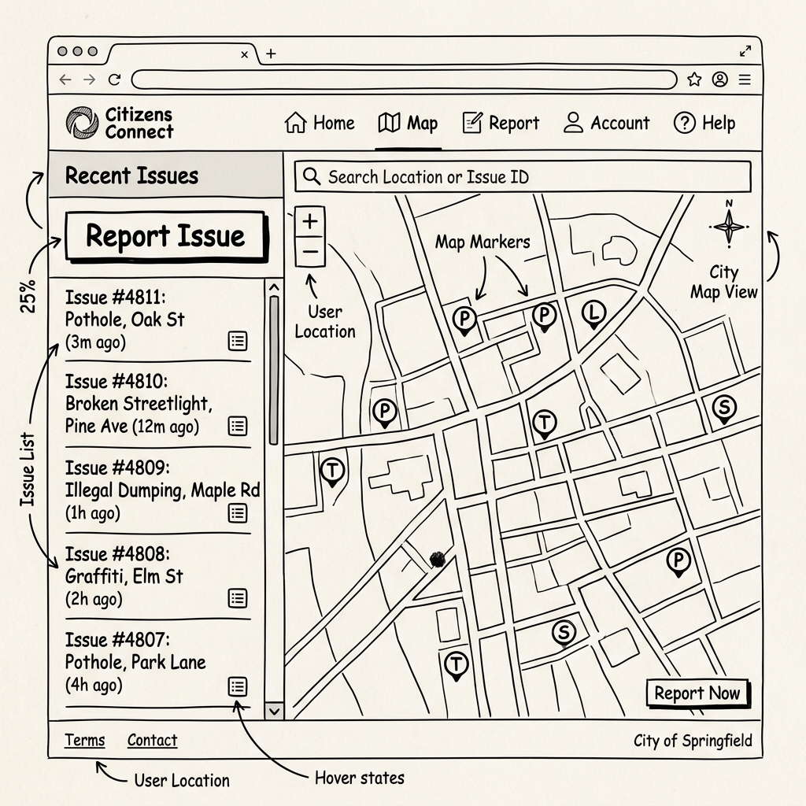
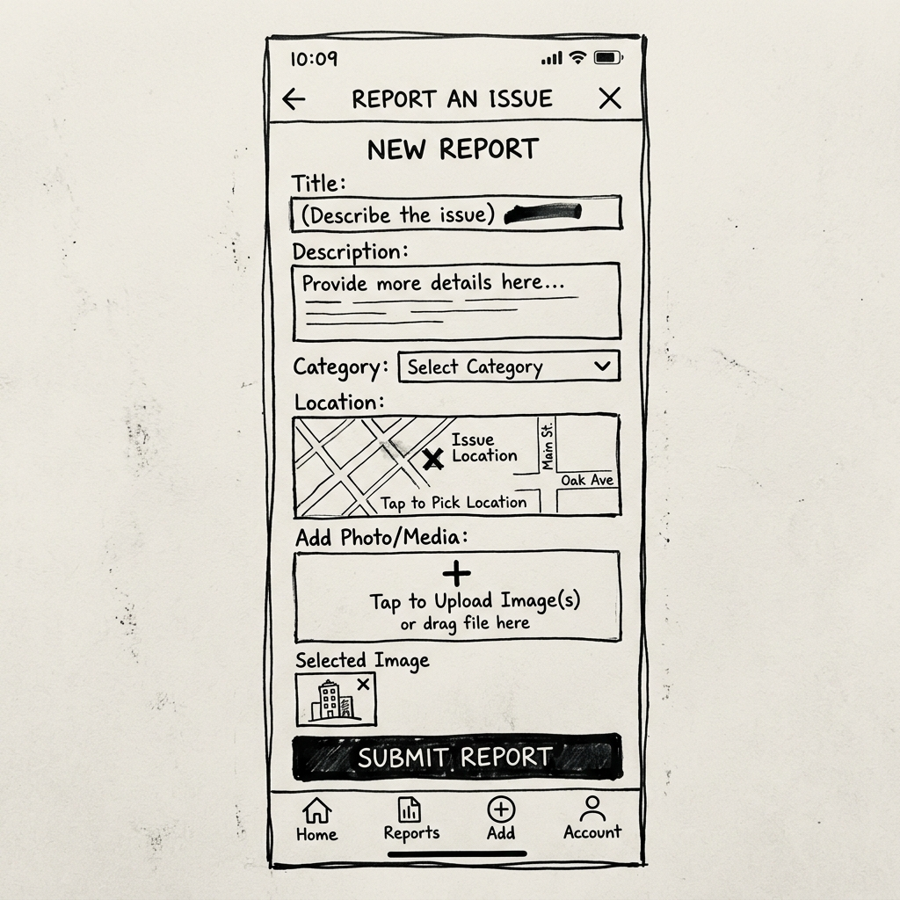
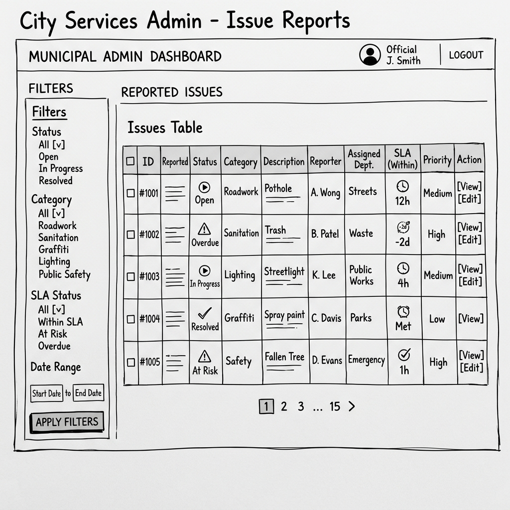

# Wireframes

Këto figura janë skica konceptuale të paketës fillestare, jo screenshot-e të
implementimit dhe jo burim autoritativ për arkitekturën apo privatësinë.
Dizajni real responsive në `app/` dhe `components/` ka përparësi.

## Public map — desktop concept

Koncepti parashikon hartën dhe listën anësore. Implementimi real nuk publikon
adresë të saktë ose user location; përdor vetëm `public_location`.

## Citizen reporting — mobile concept

Implementimi real shton validim server-side, sugjerime për duplikate dhe
heqjen e EXIF/GPS metadata.

## Official dashboard — future concept

Kjo figurë është draft historik për Sprintet 6–7. Etiketat e saj ilustrative
(përfshirë kategori jashtë scope-it) nuk janë kërkesa të produktit dhe nuk
duhet të përdoren në punimin final. Dashboard-i autoritativ do të dalë nga
workflow-i real, kategoritë e miratuara dhe të dhënat sintetike.
